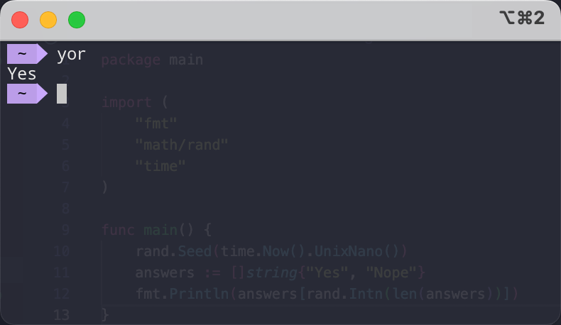

# Collection of small utilities that I use

## Google Chrome Extension
[Translate in Google Translate (Japanese to English)](https://github.com/nyok/Utilities/tree/main/Google%20Chrome/Extensions/translateInGoogleTranslateJpToEn)
 

## Console
[Yes or No](https://github.com/nyok/Utilities/tree/main/Console/YesOrNo) - Randomly displays "Yes" or "No"
 

## Parsers
[checkAvailabilityLamoda](https://github.com/nyok/Utilities/tree/main/checkAvailabilityLamoda) - Checking the quantity of brand goods on Lamoda
 

## Images
[createImageBookSet](https://github.com/nyok/Utilities/tree/main/Images/createImageBookSet) - Bash script to transform and merge an image together
 

## PingAndTelegramNotify
[PingAndTelegramNotify](https://github.com/nyok/Utilities/tree/main/Images/PingAndTelegramNotify) - Script continuously monitors the availability of a specified IP address or domain and sends notification messages to a Telegram channel if the target becomes unavailable.

## Screenshsot
[ScreenshotWithChromedriverAndSelenium](https://github.com/nyok/Utilities/tree/main/Images/ScreenshotWithChromedriverAndSelenium) - Create a screenshot of a webpage using Selenium WebDriver and ChromeDriver
 ChromeDriver matching your Google Chrome version from https://chromedriver.chromium.org/downloads
