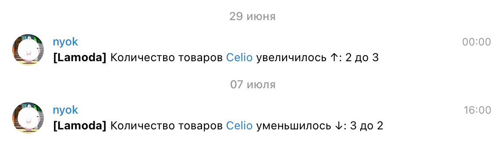

# Collection of small utilities that I use

## Google Chrome Extension
[Translate in Google Translate (Japanese to English)](https://github.com/nyok/Utilities/tree/main/Google%20Chrome/Extensions/translateInGoogleTranslateJpToEn)

## Console
[Yes or No](https://github.com/nyok/Utilities/tree/main/Console/YesOrNo) - Randomly displays "Yes" or "No"

## Parsers
[checkAvailabilityLamoda](https://github.com/nyok/Utilities/tree/main/checkAvailabilityLamoda) - Checking the quantity of brand goods on Lamoda

## Images
[createImageBookSet](https://github.com/nyok/Utilities/tree/main/Images/createImageBookSet) - Bash script to transform and merge an image together

